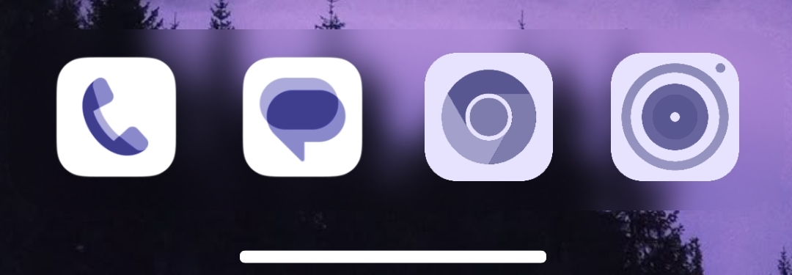
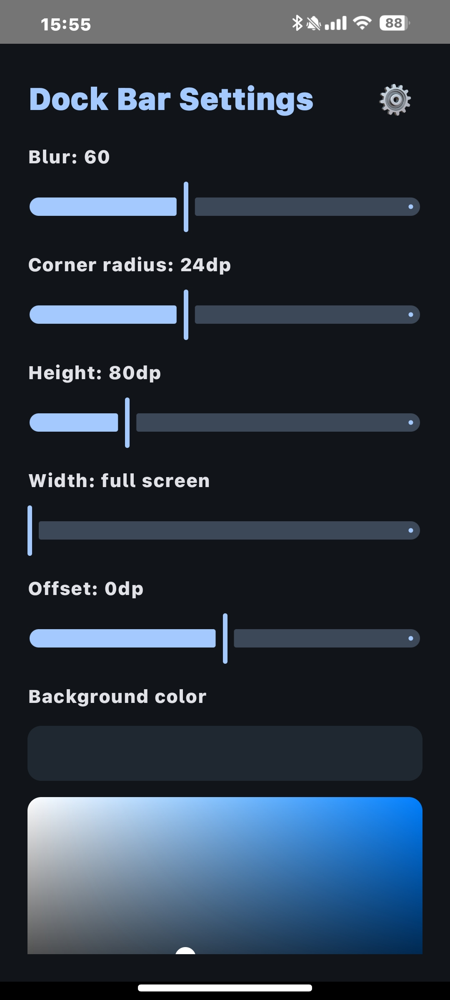
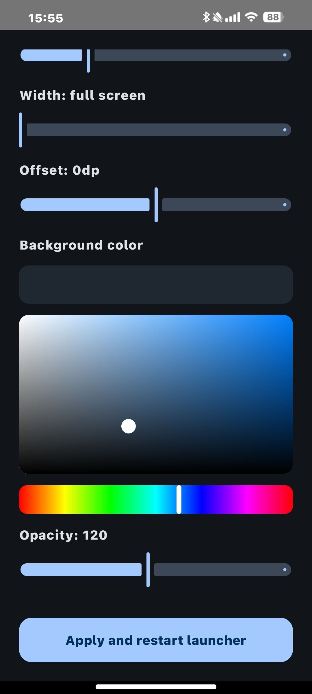

# DockBar

An LSPosed module that adds a background (blurred or solid) behind the dock icons.

    
  
  

## Tested on
HyperOS 2 (Android 14), launcher version 5.39.40.11704-09172004

## Requirements
- Android 12+
- Root (Magisk / KernelSU / APatch + forks)
- LSPosed
- POCO Launcher or MIUI Home

## Install
1. Grab the APK from Releases.
2. Enable the module in LSPosed and set the scope to POCO Launcher / MIUI Home.
3. Reboot.
4. Open the app, tweak the settings, and hit Apply.

If something breaks, ping me on Telegram and we'll figure it out.

**Telegram:** [xmfas_utb](https://t.me/xmfas_utb)

---

P.S. I know what you're thinking: why not just use HyperCeiler? Yeah, it has dock blur, but only for Xiaomi/Redmi launchers. I made this mainly for POCO users on HyperOS 2. Maybe newer HyperCeiler builds added POCO support by now, idk ¯\_(ツ)_/¯  
Works on Xiaomi/Redmi launchers too btw.